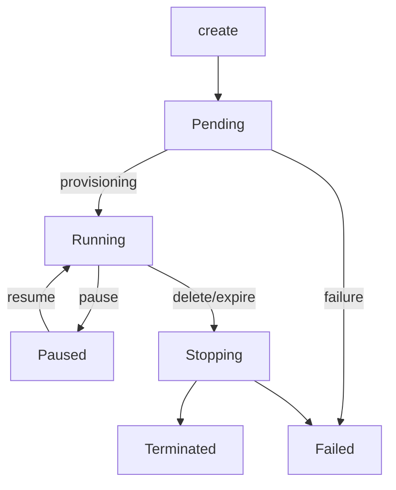

## Overview

The OpenSandbox Server is a production-grade, FastAPI-based service that acts as the control plane for managing the lifecycle of containerized sandboxes. It provides standardized REST interfaces for creating, running, monitoring, and disposing of isolated execution environments across container platforms.

## Core Capabilities

### Lifecycle APIs

Standardized REST interfaces for complete sandbox management:
- Create and provision sandboxes
- Start, pause, and resume operations
- Delete and cleanup
- Status monitoring with transition tracking

### Pluggable Runtimes

<CardGroup cols={2}>
  <Card title="Docker" icon="docker">
    Production-ready runtime for local and single-host deployments
  </Card>
  <Card title="Kubernetes" icon="dharmachakra">
    Distributed runtime for cluster deployments (see `kubernetes/` directory)
  </Card>
</CardGroup>

### Networking Modes

**Host Mode**: Containers share the host network for maximum performance. Only one sandbox instance at a time.

**Bridge Mode**: Isolated container networking with built-in HTTP routing support.

### Access Control

API Key authentication via `OPEN-SANDBOX-API-KEY` header. Can be disabled for local/dev environments.

### Resource Management

- **Resource quotas**: CPU/memory limits with Kubernetes-style specs (e.g., `500m`, `512Mi`)
- **Automatic expiration**: Configurable TTL with renewal support
- **Registry support**: Public and private container images

## Extended Features

- **Async provisioning**: Background creation to reduce API latency
- **Timer restoration**: Expiration timers restored after server restart
- **Environment injection**: Per-sandbox environment variables and metadata
- **Port resolution**: Dynamic endpoint generation for service access
- **Structured errors**: Standard error codes and messages

## Requirements

- **Python**: 3.10 or higher
- **Package Manager**: [uv](https://github.com/astral-sh/uv) (recommended) or pip
- **Runtime Backend**:
  - Docker Engine 20.10+ (for Docker runtime)
  - Kubernetes 1.21+ (for Kubernetes runtime)
- **Operating System**: Linux, macOS, or Windows with WSL2

## Installation

Install from PyPI:

```bash
uv pip install opensandbox-server
```

<Note>
For source development or contributions, clone the repo and run `uv sync` inside `server/`.
</Note>

## Configuration

The server uses a TOML configuration file to select and configure the underlying runtime.

### Initialize Configuration

Create a configuration file from a template:

```bash
# Docker example
opensandbox-server init-config ~/.sandbox.toml --example docker

# Kubernetes example
opensandbox-server init-config ~/.sandbox.toml --example k8s

# Add --force to overwrite existing file
```

### Docker Runtime Examples

<Tabs>
  <Tab title="Host Networking">
    ```toml
    [server]
    host = "0.0.0.0"
    port = 8080
    log_level = "INFO"
    api_key = "your-secret-api-key-change-this"

    [runtime]
    type = "docker"
    execd_image = "opensandbox/execd:v1.0.6"

    [docker]
    network_mode = "host"  # Containers share host network
    ```
  </Tab>
  <Tab title="Bridge Networking">
    ```toml
    [server]
    host = "0.0.0.0"
    port = 8080
    log_level = "INFO"
    api_key = "your-secret-api-key-change-this"

    [runtime]
    type = "docker"
    execd_image = "opensandbox/execd:v1.0.6"

    [docker]
    network_mode = "bridge"  # Isolated container networking
    ```
  </Tab>
  <Tab title="Security Hardening">
    ```toml
    [docker]
    # Drop dangerous capabilities
    drop_capabilities = [
      "AUDIT_WRITE", "MKNOD", "NET_ADMIN", "NET_RAW",
      "SYS_ADMIN", "SYS_MODULE", "SYS_PTRACE", "SYS_TIME", "SYS_TTY_CONFIG"
    ]
    no_new_privileges = true
    apparmor_profile = ""        # e.g. "docker-default"
    pids_limit = 512             # prevent fork bombs
    seccomp_profile = ""         # path or profile name
    ```
  </Tab>
</Tabs>

<Info>
Further reading: [Docker container security](https://docs.docker.com/engine/security/)
</Info>

### Ingress Configuration

```toml
[ingress]
mode = "direct"  # docker runtime only supports direct
```

**Gateway Mode** (Kubernetes only):

```toml
[ingress]
mode = "gateway"

[ingress.gateway]
address = "*.example.com"  # wildcard domain or IP[:port]

[ingress.gateway.route]
mode = "wildcard"  # wildcard | uri | header
```

Routing mode examples:
- **wildcard**: `<sandbox-id>-<port>.example.com/path/to/request`
- **uri**: `10.0.0.1:8000/<sandbox-id>/<port>/path/to/request`
- **header**: `gateway.example.com` with header `OpenSandbox-Ingress-To: <sandbox-id>-<port>`

### Kubernetes Runtime

```toml
[runtime]
type = "kubernetes"
execd_image = "opensandbox/execd:v1.0.5"

[kubernetes]
kubeconfig_path = "~/.kube/config"
namespace = "opensandbox"
workload_provider = "batchsandbox"   # or "agent-sandbox"
informer_enabled = true              # Beta: enable watch-based cache
informer_resync_seconds = 300        # Beta: full list interval
informer_watch_timeout_seconds = 60  # Beta: watch restart interval
```

<Warning>
Informer settings are **beta** and enabled by default to reduce API calls. Set `informer_enabled = false` to turn off.
</Warning>

### Egress Configuration

Required when using `networkPolicy` in sandbox creation requests:

```toml
[runtime]
type = "docker"
execd_image = "opensandbox/execd:v1.0.6"

[egress]
image = "opensandbox/egress:v1.0.1"
```

<Note>
- Only supported in Docker bridge mode
- Requests with `networkPolicy` are rejected when `network_mode=host` or `egress.image` is not configured
- Main container shares the sidecar netns and drops `NET_ADMIN`
- IPv6 is disabled when egress sidecar is injected
</Note>

Example request with network policy:

```json
{
  "image": {"uri": "python:3.11-slim"},
  "entrypoint": ["python", "-m", "http.server", "8000"],
  "timeout": 3600,
  "resourceLimits": {"cpu": "500m", "memory": "512Mi"},
  "networkPolicy": {
    "defaultAction": "deny",
    "egress": [
      {"action": "allow", "target": "pypi.org"},
      {"action": "allow", "target": "*.python.org"}
    ]
  }
}
```

## Running the Server

Start the server using the installed CLI:

```bash
opensandbox-server
```

Or specify a custom config path:

```bash
opensandbox-server --config ~/.sandbox.toml
```

The server will start at `http://0.0.0.0:8080` (or your configured host/port).

### Health Check

```bash
curl http://localhost:8080/health
```

Expected response:

```json
{"status": "healthy"}
```

## API Documentation

Once running, interactive API documentation is available:

- **Swagger UI**: [http://localhost:8080/docs](http://localhost:8080/docs)
- **ReDoc**: [http://localhost:8080/redoc](http://localhost:8080/redoc)

### Authentication

Authentication is enforced only when `server.api_key` is set. All endpoints except `/health`, `/docs`, `/redoc` require the `OPEN-SANDBOX-API-KEY` header:

```bash
curl -H "OPEN-SANDBOX-API-KEY: your-secret-api-key" \
  http://localhost:8080/v1/sandboxes
```

## Example Usage

### Create a Sandbox

```bash
curl -X POST "http://localhost:8080/v1/sandboxes" \
  -H "OPEN-SANDBOX-API-KEY: your-secret-api-key" \
  -H "Content-Type: application/json" \
  -d '{
    "image": {"uri": "python:3.11-slim"},
    "entrypoint": ["python", "-m", "http.server", "8000"],
    "timeout": 3600,
    "resourceLimits": {
      "cpu": "500m",
      "memory": "512Mi"
    },
    "env": {"PYTHONUNBUFFERED": "1"},
    "metadata": {
      "team": "backend",
      "project": "api-testing"
    }
  }'
```

### Get Sandbox Details

```bash
curl -H "OPEN-SANDBOX-API-KEY: your-secret-api-key" \
  http://localhost:8080/v1/sandboxes/{sandbox-id}
```

### Get Service Endpoint

```bash
curl -H "OPEN-SANDBOX-API-KEY: your-secret-api-key" \
  http://localhost:8080/v1/sandboxes/{sandbox-id}/endpoints/8000
```

### Renew Expiration

```bash
curl -X POST "http://localhost:8080/v1/sandboxes/{sandbox-id}/renew-expiration" \
  -H "OPEN-SANDBOX-API-KEY: your-secret-api-key" \
  -H "Content-Type: application/json" \
  -d '{"expiresAt": "2024-01-15T12:30:00Z"}'
```

### Delete a Sandbox

```bash
curl -X DELETE \
  -H "OPEN-SANDBOX-API-KEY: your-secret-api-key" \
  http://localhost:8080/v1/sandboxes/{sandbox-id}
```

## Architecture

### Component Responsibilities

- **API Layer** (`src/api/`): HTTP request handling, validation, and response formatting
- **Service Layer** (`src/services/`): Business logic for sandbox lifecycle operations
- **Middleware** (`src/middleware/`): Cross-cutting concerns (authentication, logging)
- **Configuration** (`src/config.py`): Centralized configuration management
- **Runtime Implementations**: Platform-specific sandbox orchestration

### Sandbox Lifecycle States



**State Transitions:**

- **Pending**: Container is starting
- **Running**: Sandbox is active and ready
- **Paused**: Execution paused, resources held
- **Stopping**: Cleanup in progress
- **Terminated**: Successfully stopped
- **Failed**: Error during lifecycle

## Configuration Reference

### Server Configuration

| Key | Type | Default | Description |
|-----|------|---------|-------------|
| `server.host` | string | `"0.0.0.0"` | Interface to bind |
| `server.port` | integer | `8080` | Port to listen on |
| `server.log_level` | string | `"INFO"` | Python logging level |
| `server.api_key` | string | `null` | API key for authentication |

### Runtime Configuration

| Key | Type | Required | Description |
|-----|------|----------|-------------|
| `runtime.type` | string | Yes | `"docker"` or `"kubernetes"` |
| `runtime.execd_image` | string | Yes | Container image with execd binary |

### Egress Configuration

| Key | Type | Required | Description |
|-----|------|----------|-------------|
| `egress.image` | string | When using `networkPolicy` | Container image with egress binary |

### Docker Configuration

| Key | Type | Default | Description |
|-----|------|---------|-------------|
| `docker.network_mode` | string | `"host"` | `"host"` or `"bridge"` |

### Environment Variables

| Variable | Description |
|----------|-------------|
| `SANDBOX_CONFIG_PATH` | Override config file location |
| `DOCKER_HOST` | Docker daemon URL (e.g., `unix:///var/run/docker.sock`) |
| `PENDING_FAILURE_TTL` | TTL for failed pending sandboxes in seconds (default: 3600) |

## Development

### Code Quality

```bash
# Run linter
uv run ruff check

# Auto-fix issues
uv run ruff check --fix

# Format code
uv run ruff format
```

### Testing

```bash
# Run all tests
uv run pytest

# Run with coverage
uv run pytest --cov=src --cov-report=html

# Run specific test
uv run pytest tests/test_docker_service.py::test_create_sandbox_requires_entrypoint
```

## Support

- **Documentation**: See `DEVELOPMENT.md` for development guidance
- **Issues**: Report defects via GitHub Issues
- **Discussions**: Use GitHub Discussions for Q&A and ideas
