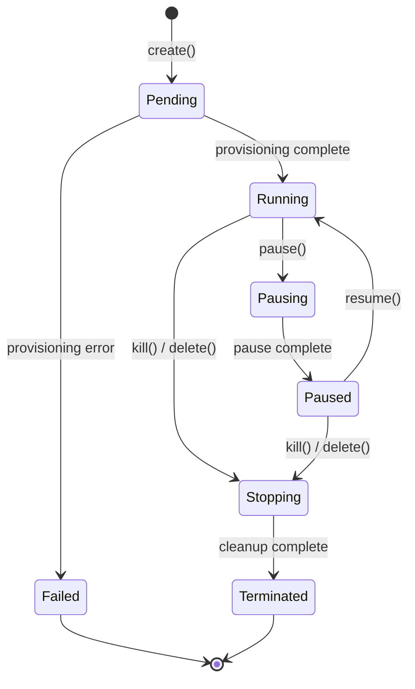

Sandboxes in OpenSandbox follow a well-defined lifecycle with distinct states and transitions. Understanding this lifecycle is essential for building robust applications.

## Lifecycle states

A sandbox progresses through the following states:

<Steps>
  <Step title="Pending">
    Initial state when a sandbox is created. The runtime is pulling the image, injecting execd, and starting the container.
  </Step>
  <Step title="Running">
    Sandbox is fully operational and ready to accept commands, execute code, and perform file operations.
  </Step>
  <Step title="Pausing">
    Transitional state when `pause()` is called. The sandbox is stopping execution.
  </Step>
  <Step title="Paused">
    Sandbox execution is suspended. No commands or code can execute, but the state is preserved.
  </Step>
  <Step title="Stopping">
    Transitional state when `kill()` or `delete()` is called. The sandbox is being terminated.
  </Step>
  <Step title="Terminated">
    Final state. The sandbox is stopped and resources are released. This state is permanent.
  </Step>
  <Step title="Failed">
    Error state. The sandbox encountered an unrecoverable error during provisioning or execution.
  </Step>
</Steps>

## State transitions



## Creating sandboxes

Sandboxes are created with the `Sandbox.create()` method:

<Tabs>
  <Tab title="Python">
    ```python
    from opensandbox import Sandbox
    from datetime import timedelta

    sandbox = await Sandbox.create(
        "python:3.11",
        timeout=timedelta(minutes=30),
        env={"PYTHON_VERSION": "3.11"},
        entrypoint=["/bin/bash"],
        resource_limits={"cpu": "2", "memory": "4Gi"}
    )
    ```
  </Tab>
  <Tab title="JavaScript">
    ```javascript
    import { Sandbox } from '@alibaba-group/opensandbox';

    const sandbox = await Sandbox.create(
      connectionConfig,
      'python:3.11',
      {
        timeoutSeconds: 1800,
        env: { PYTHON_VERSION: '3.11' },
        entrypoint: ['/bin/bash'],
        resource: { cpu: '2', memory: '4Gi' }
      }
    );
    ```
  </Tab>
  <Tab title="Kotlin">
    ```kotlin
    import opensandbox.Sandbox
    import java.time.Duration

    val sandbox = Sandbox.builder(connectionConfig)
        .image("python:3.11")
        .timeout(Duration.ofMinutes(30))
        .env(mapOf("PYTHON_VERSION" to "3.11"))
        .entrypoint(listOf("/bin/bash"))
        .resourceLimits(mapOf("cpu" to "2", "memory" to "4Gi"))
        .build()
        .create()
    ```
  </Tab>
</Tabs>

### Required parameters

<ParamField path="image" type="string" required>
  Docker image to use for the sandbox. Can be from Docker Hub or a private registry.
</ParamField>

<ParamField path="timeout" type="duration" required>
  Sandbox lifetime (60 seconds to 24 hours). After this time, the sandbox is automatically terminated.
</ParamField>

<ParamField path="entrypoint" type="string[]" required>
  Command to run as the main process. This keeps the sandbox running.
</ParamField>

### Optional parameters

<ParamField path="env" type="object">
  Environment variables to set in the sandbox.
</ParamField>

<ParamField path="resourceLimits" type="object">
  CPU, memory, and GPU limits (e.g., `{"cpu": "500m", "memory": "512Mi"}`).
</ParamField>

<ParamField path="metadata" type="object">
  Custom metadata for tracking and filtering sandboxes.
</ParamField>

<ParamField path="networkPolicy" type="object">
  Egress network policy rules (allow/deny domains).
</ParamField>

## Managing sandbox lifetime

### Automatic expiration

All sandboxes have a **TTL (time-to-live)** specified at creation. When the timeout expires, the sandbox is automatically terminated.

<Warning>
  The minimum timeout is 60 seconds, and the maximum is 86400 seconds (24 hours). Choose a timeout based on your workload duration.
</Warning>

### Renewing expiration

You can extend the sandbox lifetime before it expires:

```python
# Extend by 10 more minutes
await sandbox.renew_expiration(timedelta(minutes=10))
```

<Tip>
  Call `renew_expiration()` before the current timeout expires to keep long-running workloads alive.
</Tip>

### Manual termination

To immediately terminate a sandbox:

```python
await sandbox.kill()
```

This transitions the sandbox to the **Stopping** state and then to **Terminated**.

## Pausing and resuming

You can temporarily pause a sandbox to save resources:

```python
# Pause execution
await sandbox.pause()

# Resume execution
await sandbox.resume()
```

<Info>
  **Note**: Pause/resume is currently supported in Docker runtime with host networking mode. Kubernetes runtime support is planned.
</Info>

## Monitoring sandbox state

Check the current state of a sandbox:

```python
info = await sandbox.get_info()
print(f"State: {info.state}")
print(f"Created: {info.created_at}")
print(f"Expires: {info.expires_at}")
```

### Polling for readiness

When you create a sandbox, it starts in the **Pending** state. The SDK automatically polls until it reaches **Running**:

```python
# The create() method waits until the sandbox is Running
sandbox = await Sandbox.create("ubuntu:22.04")

# At this point, the sandbox is ready to use
await sandbox.commands.run("echo 'Hello'")
```

### Custom health checks

For sandboxes running services, you can implement custom health checks:

<Tabs>
  <Tab title="Python">
    ```python
    async def check_web_service():
        endpoint = await sandbox.get_endpoint(8000)
        response = await httpx.get(f"{endpoint}/health")
        return response.status_code == 200

    sandbox = await Sandbox.create(
        "my-web-service:latest",
        health_check=check_web_service,
        ready_timeout=timedelta(seconds=30)
    )
    ```
  </Tab>
  <Tab title="JavaScript">
    ```javascript
    async function checkWebService() {
      const endpoint = await sandbox.getEndpoint(8000);
      const response = await fetch(`${endpoint}/health`);
      return response.ok;
    }

    const sandbox = await Sandbox.create(
      connectionConfig,
      'my-web-service:latest',
      {
        healthCheck: checkWebService,
        readyTimeoutSeconds: 30
      }
    );
    ```
  </Tab>
</Tabs>

## Error handling

Sandboxes can enter the **Failed** state due to:

- Image pull failures (invalid image, authentication issues)
- Resource limit exceeded during startup
- Entrypoint command errors
- Network policy violations

Handle errors with try-catch:

```python
from opensandbox.exceptions import SandboxException

try:
    sandbox = await Sandbox.create("invalid-image:latest")
except SandboxException as e:
    print(f"Error: {e.error.code} - {e.error.message}")
```

## Best practices

<AccordionGroup>
  <Accordion title="Choose appropriate timeouts">
    Set timeouts based on expected workload duration:
    - Short tasks (< 5 min): 5-10 minutes
    - Interactive sessions: 30-60 minutes
    - Long-running jobs: 2-24 hours
    
    Use `renew_expiration()` for unpredictable durations.
  </Accordion>
  
  <Accordion title="Always clean up resources">
    Use context managers (Python) or try-finally blocks to ensure sandboxes are terminated:
    
    ```python
    async with await Sandbox.create("ubuntu") as sandbox:
        # Use sandbox
        pass
    # Sandbox is automatically killed
    ```
  </Accordion>
  
  <Accordion title="Monitor sandbox state">
    For long-running workloads, periodically check sandbox state:
    
    ```python
    info = await sandbox.get_info()
    if info.state == "Failed":
        # Handle failure
        pass
    ```
  </Accordion>
  
  <Accordion title="Handle transient errors">
    Image pulls can fail due to network issues. Implement retry logic:
    
    ```python
    for attempt in range(3):
        try:
            sandbox = await Sandbox.create("python:3.11")
            break
        except SandboxException as e:
            if attempt == 2:
                raise
            await asyncio.sleep(5)
    ```
  </Accordion>
</AccordionGroup>

<CardGroup cols={2}>
  <Card title="Execution API" icon="terminal" href="/concepts/execution-api">
    Learn how to execute commands and code in running sandboxes
  </Card>
  <Card title="API Reference" icon="code" href="/api/lifecycle/create-sandbox">
    View the complete Lifecycle API reference
  </Card>
  <Card title="Resource management" icon="gauge" href="/operations/resource-management">
    Optimize resource usage and limits
  </Card>
  <Card title="Troubleshooting" icon="wrench" href="/operations/troubleshooting">
    Diagnose and fix common sandbox issues
  </Card>
</CardGroup>