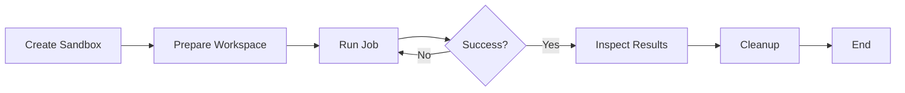

## Overview

This example demonstrates how to build a sophisticated AI agent workflow using LangGraph and OpenSandbox. The integration creates a state machine that orchestrates sandbox operations, including creation, file operations, command execution, error handling with retries, and AI-powered result summarization.

## Prerequisites

- OpenSandbox server running locally or remotely
- Docker with the code-interpreter image
- Anthropic API credentials
- Python with `uv` package manager

## Setup

### 1. Pull the Code Interpreter Image

```bash
docker pull sandbox-registry.cn-zhangjiakou.cr.aliyuncs.com/opensandbox/code-interpreter:v1.0.1

# Alternative: Docker Hub
# docker pull opensandbox/code-interpreter:v1.0.1
```

### 2. Start OpenSandbox Server

```bash
uv pip install opensandbox-server
opensandbox-server init-config ~/.sandbox.toml --example docker
opensandbox-server
```

### 3. Install Dependencies

```bash
uv pip install opensandbox langgraph langchain-anthropic
```

## Workflow Architecture

The LangGraph workflow implements a state machine with the following nodes:



## Implementation

### State Definition

First, define the workflow state that will be passed between nodes:

```python
from typing import TypedDict
from opensandbox import Sandbox

class WorkflowState(TypedDict):
    sandbox: Sandbox | None
    run_output: str
    summary: str
    last_error: str
    attempt: int
    max_attempts: int
    command: str
    fallback_command: str
    cleaned: bool
```

### Node Implementations

#### Create Sandbox Node

```python
import os
from datetime import timedelta
from opensandbox import Sandbox
from opensandbox.config import ConnectionConfig

async def create_sandbox(state: WorkflowState) -> WorkflowState:
    print("[create] Creating sandbox")
    domain = os.getenv("SANDBOX_DOMAIN", "localhost:8080")
    api_key = os.getenv("SANDBOX_API_KEY")
    image = os.getenv(
        "SANDBOX_IMAGE",
        "sandbox-registry.cn-zhangjiakou.cr.aliyuncs.com/opensandbox/code-interpreter:v1.0.1",
    )

    config = ConnectionConfig(
        domain=domain,
        api_key=api_key,
        request_timeout=timedelta(seconds=120),
    )

    sandbox = await Sandbox.create(image, connection_config=config)
    print(f"[create] Sandbox ready: {sandbox.id}")

    return {**state, "sandbox": sandbox}
```

#### Prepare Workspace Node

```python
async def prepare_workspace(state: WorkflowState) -> WorkflowState:
    print("[prepare] Writing job files")
    sandbox = state["sandbox"]
    if sandbox is None:
        raise RuntimeError("Sandbox not initialized")

    await sandbox.files.write_file(
        "/tmp/math.py",
        "result = 137 * 42\nprint(result)\n",
    )
    await sandbox.files.write_file(
        "/tmp/notes.txt",
        "LangGraph + OpenSandbox\n",
    )

    print("[prepare] Files written")
    return state
```

#### Run Job Node with Retry Logic

```python
async def run_job(state: WorkflowState) -> WorkflowState:
    attempt = state["attempt"] + 1
    max_attempts = state["max_attempts"]
    command = state.get("command") or "python3 /tmp/math.py"
    print(f"[run] Executing job (attempt {attempt}/{max_attempts})")
    
    sandbox = state["sandbox"]
    if sandbox is None:
        raise RuntimeError("Sandbox not initialized")

    execution = await sandbox.commands.run(command)
    
    # Format output
    stdout = "\n".join(msg.text for msg in execution.logs.stdout)
    stderr = "\n".join(msg.text for msg in execution.logs.stderr)
    run_output = stdout.strip()
    last_error = ""
    next_command = command

    # Handle errors with fallback
    if execution.error:
        last_error = f"{execution.error.name}: {execution.error.value}"
        if attempt < max_attempts:
            next_command = state.get("fallback_command", "python /tmp/math.py")
            print(f"[run] Failed, scheduling fallback: {next_command}")

    return {
        **state,
        "run_output": run_output,
        "last_error": last_error,
        "attempt": attempt,
        "command": next_command,
    }
```

#### Decision Node

```python
def decide_next(state: WorkflowState) -> str:
    if state.get("last_error") and state["attempt"] < state["max_attempts"]:
        print("[decide] Retry with fallback command")
        return "run"
    
    print("[decide] Proceeding to inspect")
    return "inspect"
```

#### Inspect Results with AI

```python
from langchain_anthropic import ChatAnthropic

async def inspect_results(state: WorkflowState) -> WorkflowState:
    print("[inspect] Reading notes and summarizing")
    sandbox = state["sandbox"]
    if sandbox is None:
        raise RuntimeError("Sandbox not initialized")

    notes = await sandbox.files.read_file("/tmp/notes.txt")
    
    llm = ChatAnthropic(
        model=os.getenv("ANTHROPIC_MODEL", "claude-3-5-sonnet-latest"),
    )
    
    prompt = (
        "Summarize the sandbox run result and notes in one sentence. "
        f"Run output: {state.get('run_output', '')}. "
        f"Notes: {notes.strip()}."
    )
    response = await llm.ainvoke(prompt)

    print(f"[inspect] Summary: {response.content}")
    return {**state, "summary": response.content}
```

#### Cleanup Node

```python
async def cleanup_sandbox(state: WorkflowState) -> WorkflowState:
    print("[cleanup] Cleaning up sandbox")
    sandbox = state.get("sandbox")
    if sandbox is not None:
        await sandbox.kill()
        await sandbox.close()

    print("[cleanup] Done")
    return {**state, "sandbox": None, "cleaned": True}
```

### Building the Graph

```python
from langgraph.graph import END, StateGraph

async def main() -> None:
    # Build the workflow graph
    graph = StateGraph(WorkflowState)
    
    # Add nodes
    graph.add_node("create", create_sandbox)
    graph.add_node("prepare", prepare_workspace)
    graph.add_node("run", run_job)
    graph.add_node("inspect", inspect_results)
    graph.add_node("cleanup", cleanup_sandbox)
    
    # Define edges
    graph.set_entry_point("create")
    graph.add_edge("create", "prepare")
    graph.add_edge("prepare", "run")
    graph.add_conditional_edges(
        "run",
        decide_next,
        {
            "run": "run",        # Retry
            "inspect": "inspect", # Success
        },
    )
    graph.add_edge("inspect", "cleanup")
    graph.add_edge("cleanup", END)
    
    # Compile and execute
    app = graph.compile()
    
    initial_state = {
        "sandbox": None,
        "run_output": "",
        "summary": "",
        "last_error": "",
        "attempt": 0,
        "max_attempts": 2,
        "command": "python3 /tmp/math.py",
        "fallback_command": "python /tmp/math.py",
        "cleaned": False,
    }
    
    # Run the workflow
    async for update in app.astream(initial_state, stream_mode="values"):
        state = update
    
    print(f"Run output: {state['run_output']}")
    print(f"Summary: {state['summary']}")

if __name__ == "__main__":
    import asyncio
    asyncio.run(main())
```

## Environment Variables

| Variable | Required | Default | Description |
|----------|----------|---------|-------------|
| `SANDBOX_DOMAIN` | No | `localhost:8080` | Sandbox service address |
| `SANDBOX_API_KEY` | No | - | API key for authentication |
| `SANDBOX_IMAGE` | No | `opensandbox/code-interpreter:v1.0.1` | Docker image |
| `ANTHROPIC_API_KEY` | Yes* | - | Anthropic API key |
| `ANTHROPIC_AUTH_TOKEN` | Yes* | - | Anthropic auth token |
| `ANTHROPIC_BASE_URL` | No | - | Custom API endpoint |
| `ANTHROPIC_MODEL` | No | `claude-3-5-sonnet-latest` | Model name |

*Note: Provide either `ANTHROPIC_API_KEY` or `ANTHROPIC_AUTH_TOKEN`, not both.

## Running the Example

```bash
export ANTHROPIC_API_KEY="your-api-key-here"
uv run python examples/langgraph/main.py
```

## Key Features

### State Machine Workflow
- Graph-based execution flow with conditional branching
- Automatic retry logic with fallback commands
- Clean state management across nodes

### Error Handling
- Automatic retry on command failures
- Fallback command execution (e.g., `python3` → `python`)
- Guaranteed cleanup even on failures

### AI Integration
- Claude-powered result summarization
- Context-aware analysis of execution outputs
- Seamless LangChain integration

### Resource Management
- Proper sandbox lifecycle management
- Cleanup guarantees with try/finally patterns
- Async operations for efficiency

## Use Cases

- **Multi-step AI Workflows**: Chain multiple AI operations with state
- **Code Execution Pipelines**: Run, test, and analyze code automatically
- **Error Recovery**: Implement sophisticated retry and fallback logic
- **Result Analysis**: Use AI to summarize and interpret execution results
- **CI/CD Integration**: Build automated testing and deployment workflows

## Advanced Patterns

### Adding More Nodes

Extend the workflow with additional processing steps:

```python
async def validate_output(state: WorkflowState) -> WorkflowState:
    # Custom validation logic
    return state

graph.add_node("validate", validate_output)
graph.add_edge("run", "validate")
graph.add_edge("validate", "inspect")
```

### Parallel Execution

Run multiple operations concurrently:

```python
from langgraph.graph import START

graph.add_node("task1", task1_node)
graph.add_node("task2", task2_node)
graph.add_edge(START, "task1")
graph.add_edge(START, "task2")
```

## References

- [LangGraph Documentation](https://langchain-ai.github.io/langgraph/)
- [LangChain Anthropic Integration](https://python.langchain.com/docs/integrations/chat/anthropic)
- [OpenSandbox Python SDK](/sdks/python/overview)
